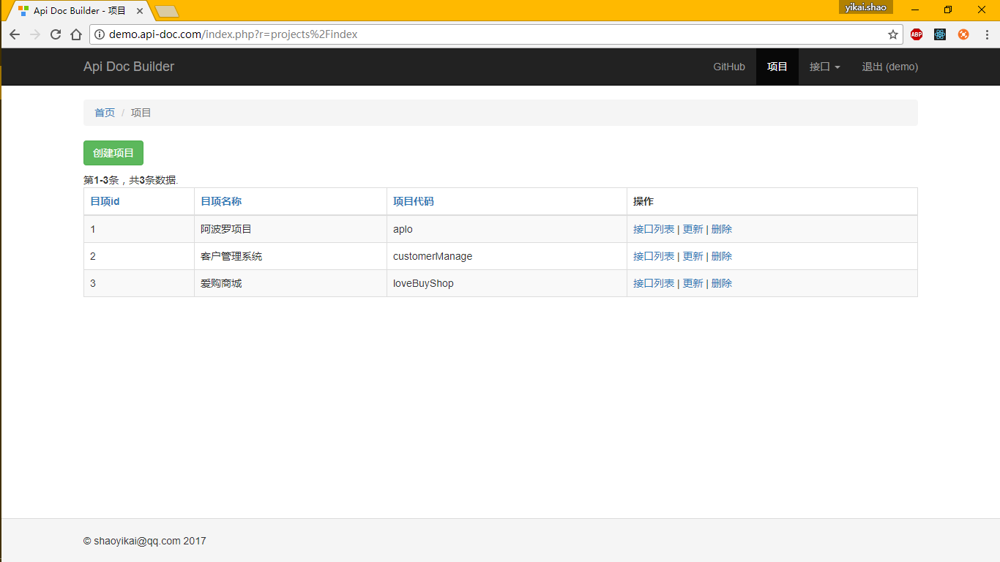
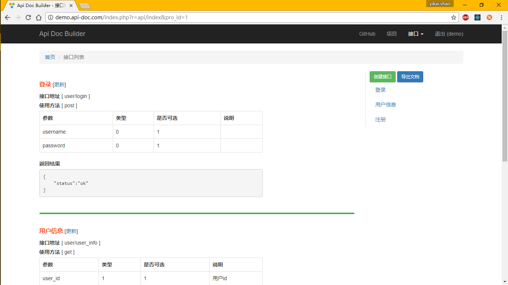
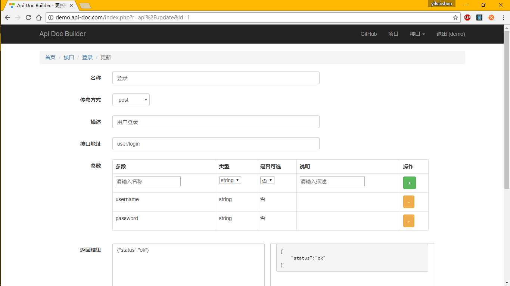

API 文档生成器
============================

[](https://packagist.org/packages/shaoyikai/api-doc)
[](https://packagist.org/packages/shaoyikai/api-doc)
[](https://packagist.org/packages/shaoyikai/api-doc)


随着现代应用越来越复杂，前后分离也变得越来越流行。

为什么呢？

因为分离之后，前后端可以更加专注地去做各自更擅长的事情。
前端：专心地去编写UI设计的漂亮界面和交互，功能上只需要调用后台开发好的一个个API即可；
后端：专注于应用的处理逻辑编写，数据库的设计等，最终把输入和输出封装成一个个清晰的API供前端人员调用。
前后端需求有变更的时候，各自不会互相影响，非常有利于后期的维护。

可是，前后端配合得愉快吗？……

前后分离很好，可是为什么很多开发人员，还是被沟通搞得焦头烂额了呢？
我觉得主要是因为没有一个清晰的接口文档，更准确的说，是没有一个“及时更新的”“清晰的”接口文档！

so，本程序旨在方便快捷的编写api文档，同时提供一些有用的工具，让编写api文档成为一件轻松惬意的工作！


先睹为快
-------------------





目录结构
-------------------

项目采用PHP框架yii2 framework，目录结构如下：

      assets/
      commands/
      config/
      controllers/
      mail/
      models/
      runtime/
      tests/
      vendor/
      views/
      web/


安装说明
-------------------
  - 该程序运行所需要的PHP版本为 5.5以上，因为5.4以下的composer会报错。
  - 如果尚未安装composer插件`composer-asset-plugin`，您需要执行`composer global require "fxp/composer-asset-plugin:~1.1.1"`进行安装
  - 执行安装命令：`composer create-project shaoyikai/api-doc`
  - 创建数据库api-doc，字符集选择utf-8，配置数据库config/db.php
  - 在根目录执行命令：`php yii migrate` ，选择yes。（需将php添加到系统环境变量）
  - 配置虚拟主机（如：`http://demo.api-doc.com`）到 /web/ 目录下面。


配置数据库参考
-------------
编辑文件 `config/db.php`：

```php
return [
    'class' => 'yii\db\Connection',
    'dsn' => 'mysql:host=localhost;dbname=api-doc',
    'username' => 'root',
    'password' => '1234', // 根据自己的环境填写
    'charset' => 'utf8',
];
```

Apache虚拟主机配置参考
-------------

```php
<VirtualHost *:80>
    ServerAdmin someone@example.com
    DocumentRoot "C:/www/api-doc/web"
    ServerName demo.api-doc.com
    ErrorLog "logs/api-doc.com-error.log"
    CustomLog "logs/api-doc.com-access.log" common

	<Directory "C:/www/api-doc/web">
		AllowOverride all
		Require all granted
	</Directory>
</VirtualHost>
```

**注意：** 数据库需要手动创建


待开发功能
-------------

[功能列表](todoTask.md)


License
-------------

api-doc is released under the BSD License. See the bundled [LICENSE](LICENSE.md) for details.
